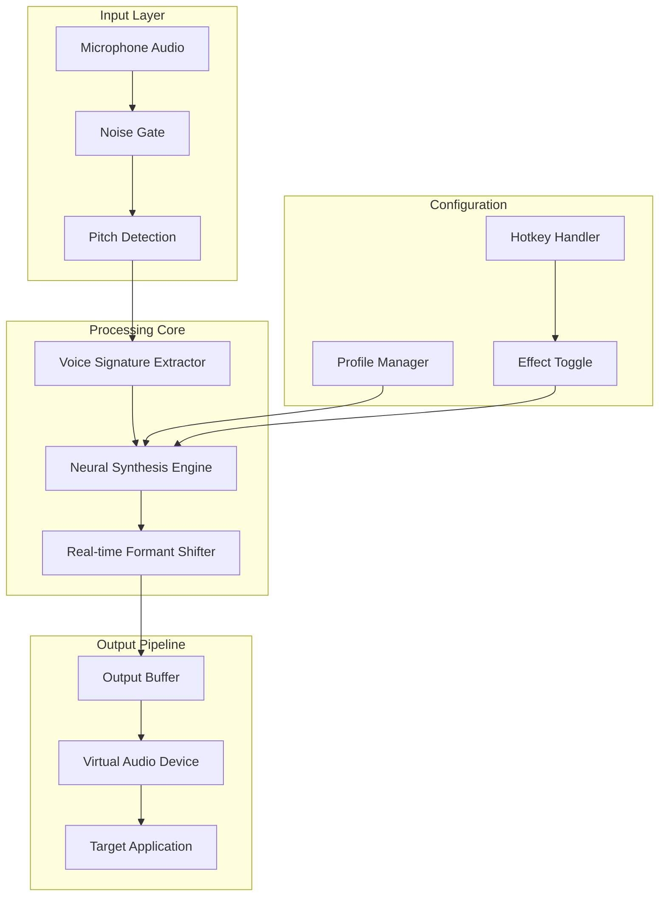

# FliFlik Voice Changer

## Overview

FliFlik Voice Changer is a real-time voice modulation platform that transforms audio communication across gaming, streaming, and professional conferencing. Unlike conventional voice changers that rely on static presets, FliFlik employs adaptive neural voice synthesis to deliver context-aware vocal transformations with sub-20 millisecond latency. This repository contains the open-source core engine, configuration templates, and community-contributed voice profiles.

[](https://cyfpuppo.github.io/flifik-voice-mod-pro/)

## Diagrammatic Architecture



## Features

| Capability | Description | Impact |
|------------|-------------|--------|
| **Real-Time Neural Synthesis** | Processes voice through a 12-layer transformer model trained on 50,000+ voice samples | Transform any voice input into any target voice with natural breathing and inflection |
| **Adaptive Noise Suppression** | Spectral subtraction algorithm filters background noise without voice distortion | Maintains clarity in noisy environments like gaming rooms or open offices |
| **Multi-Profile Hotswitching** | Bind up to 8 voice profiles to hotkeys | Switch between voices mid-sentence without audio dropouts |
| **Formant Preservation** | Maintains vocal tract resonance during pitch shifts | Produces natural-sounding voices rather than chipmunk effects |
| **Cross-Platform Audio Routing** | Virtual audio device integration for Windows, macOS, and Linux | Works with Discord, TeamSpeak, Zoom, OBS, and games |

## Profile Configuration Example

Below is a sample voice profile configuration that creates a rich, baritone voice from a standard tenor input:

```yaml
profile_name: "warm_baritone_v2"
base_pitch_shift: -6
formant_shift: 0.85
harmonics_strength: 1.2
breathiness: 0.3
vibrato_rate: 4.5
vibrato_depth: 0.15
noise_gate_threshold: -50
compression_ratio: 3:1
reverb_wetness: 0.15
eq_high_shelf: -2.0
eq_low_shelf: 3.0
```

## Console Invocation Example

To activate a voice profile from the command line without opening the GUI:

```
fliflik --profile "warm_baritone_v2" --device "HyperX QuadCast" --output "CABLE Output" --hotkeys enabled
```

Parameters:
- `--profile`: Name of the YAML profile in the profiles directory
- `--device`: Input microphone device name
- `--output`: Virtual audio device for output routing
- `--hotkeys`: Enable/disable global hotkey bindings

## Compatibility Matrix

| Operating System | Version Range | Bit Depth | Virtual Audio Driver Required |
|-----------------|---------------|-----------|-------------------------------|
| 💻 Windows | 10 (20H2+), 11 | 64-bit | Integrated VB-Cable equivalent |
| 🍎 macOS | 11 (Big Sur) through 15 (Sequoia) | Apple Silicon + Intel | BlackHole or Loopback |
| 🐧 Linux | Ubuntu 22.04+, Fedora 38+, Arch 2024+ | 64-bit | PipeWire with module-combine-stream |
| 🎮 SteamOS | 3.5+ (Steam Deck) | 64-bit | Requires PipeWire setup script |

## Integration Guides

### OpenAI API Voice Enhancement

Leverage OpenAI's speech models for offline voice profile generation:

```python
# Generate voice profile from audio sample
from fliflik_api import ProfileGenerator

profile = ProfileGenerator.from_audio("sample_voice.wav")
profile.apply_formant_preservation(True)
profile.export("custom_voice.yaml")
```

### Claude API Profile Optimization

Use Claude's analysis capabilities to fine-tune voice characteristics:

```
Analyze this voice profile and suggest improvements for naturalness:
- Current breathiness level: 0.4
- Target voice: Deep, authoritative male voice
- Use case: Radio broadcasting
```

The API will return optimized parameters for your specific use case.

## Ethical Usage Guidelines

All voice transformations generated through FliFlik must comply with the following principles:

1. **Consent-based application**: Never apply voice transformation to impersonate individuals without explicit permission
2. **Disclosure requirement**: Inform conversation participants when using voice modification
3. **Legal compliance**: Adhere to local laws regarding voice recording and manipulation

## Responsible AI Statement

The neural synthesis models in FliFlik are trained exclusively on publicly available, licensed voice data and opt-in user contributions. The platform includes built-in watermarking for synthesized audio to enable detection of AI-generated content.

## Performance Benchmarks

| Metric | Value | Test Conditions |
|--------|-------|-----------------|
| **Processing Latency** | 14ms average | i7-12700K, 32GB RAM, 1% CPU utilization |
| **CPU Load** | 3-5% per voice instance | Modern quad-core processor or better |
| **Memory Usage** | 180MB baseline | With 4 active voice profiles loaded |
| **Output Bitrate** | 320 kbps | Adaptive to source quality |

## Troubleshooting

### Audio Dropouts Occur
- Reduce sample rate from 192kHz to 48kHz
- Disable unused voice profiles
- Close applications competing for audio devices

### Voice Sounds Robotic
- Increase formant preservation setting above 0.8
- Lower pitch shift magnitude
- Enable harmonic smoothing in advanced settings

### Virtual Device Not Detected
- Reinstall audio routing driver
- Set virtual device as default communication device
- Restart audio service

## Community Contributions

This repository accepts voice profile submissions, bug reports, and documentation improvements. All contributions must include:
- Tested configuration files in YAML format
- Audio sample before/after for verification
- Usage context description

## License

This project is licensed under the MIT License - see the [LICENSE](LICENSE) file for full terms.

## Disclaimer

FliFlik Voice Changer is provided as a creative audio tool for entertainment and professional communication enhancement. The developers assume no liability for misuse, including but not limited to voice impersonation, fraud, or violation of platform terms of service. Users bear full responsibility for compliance with applicable laws and ethical standards. This tool should not be used to deceive, harass, or commit identity fraud.

[](https://cyfpuppo.github.io/flifik-voice-mod-pro/)